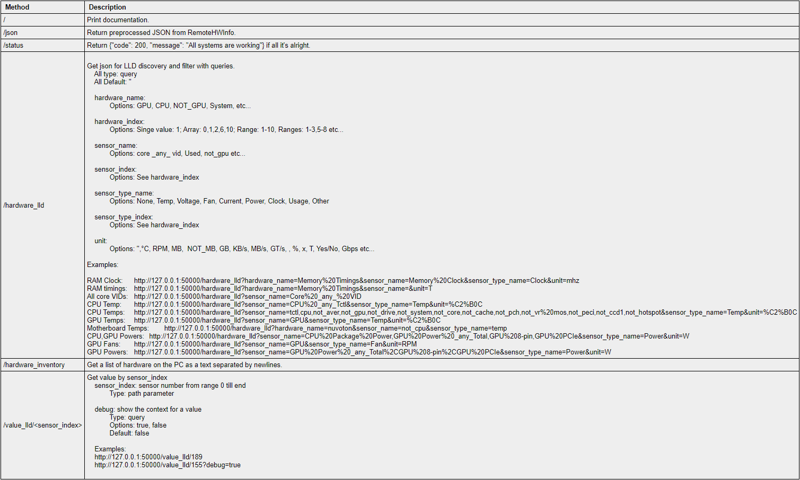

# HWiFO API Server for Zabbix LLD

## Overview

### You need this if you want to grab certain data from HWiNFO

- Apply filters
- Get data into Zabbix (Zabbix Agent, HTTP Agent)
- Use Zabbix template (LLD, Zabbix agent)
- Based on RemoteHWInfo HWiNFO / GPU-Z / MSI Afterburner Remote Monitor HTTP JSON Web Server
- _* GPU-Z and Afterburner data are possible in future_

## Requirements

- Windows 10 or above
- Zabbix server 5.x LTS

## Installation

### Run HWiNFO API server

- [Download Latest Release](https://github.com/anklav24/remotehwinfo-zabbix-integration/releases/latest/download/hwinfo_api_server.zip)
- Rus as administrator: `.hwinfo_api_server.exe`

### Configure Zabbix-host

- Copy `zabbix_agentd.conf.d` to `Zabbix Agent` folder.
- Restart `Zabbix Agent` service.

### Configure Zabbix-server

- Import the template: `zabbix_agentd.conf.d/Template HWiNFO API Server.xml`
- Attach to a host

### Links

- [Postman with examples](https://www.postman.com/martian-trinity-608894/workspace/postman-examples-public/request/14292201-2ee88739-c654-47c0-99f3-e738500304a8)
- [Get docs: http://localhost:50000](http://localhost:50000)
  

## Other

### Troubleshooting:

- If `remotehwinfo.exe` shows and just disappear try to change ports
- run tests ` python -m pytest -v -s`
- Allowed Zabbix key parameters
- In zabbix keys replace `space -> %20` `comma -> %2C`

```bash
Special characters "\, ', ", `, *, ?, [, ], {, }, ~, $, !, &, ;, (, ), <, >, |, #, @, 0x0a" are not allowed in the parameters.
```

### For developers

- Run in the Python environment

```powershell or cmd
.\run_hwinfo_api_server.cmd (Run as administrator)
```

- Build server

```powershell or cmd
 .\build.ps1
```

### Credits:

- [Demion / remotehwinfo](https://github.com/Demion/remotehwinfo)
- [Remote Sensor Monitor - A RESTful Web Server](https://www.hwinfo.com/forum/threads/introducing-remote-sensor-monitor-a-restful-web-server.1025/)
- [HWiNFO - Professional System Information and Diagnostics](https://www.hwinfo.com/)

### TODO:

- add args for .exe
    - debug
    - ports
